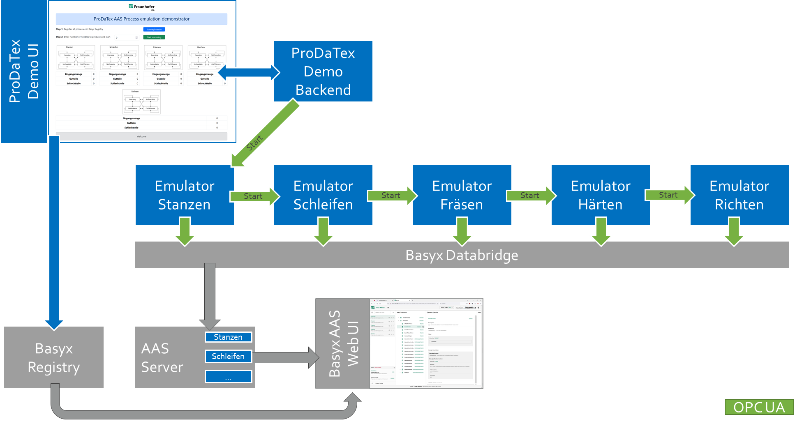

# ProDaTEX Demonstrator
This repository contains a very simplified demonstrator developed within the ProDaTEX project.
Its purpose is to show the usage of BaSyx components in combination with ProDaTEX developments in an industrial context.

The industrial use case is a data drive optimization of processes for the manufacturing of high-end needles for textile production equipment. In order to protect the IP of partners involved, the demonstrator is simplified to generic processes with only very little data. Purpose of this work is to demonstrate the conceptual design and technology.

## Quick start
In order to set the demonstrator up quickly a dockerized version is available:
* Clone this repository
* Open console and change into *Docker* folder
* Run `docker compose up`
* The demonstrator user interface can be accessed on *yourIP*:81
* The AAS UI is available on *yourIP*

## Architecture

The demonstrator is using five **emulated processes** based on the
[IPA emulation platform](https://www.ipa.fraunhofer.de/de/Kompetenzen/reinst--und-mikroproduktion/reinheitsspezifische_automatisierungssysteme/testumgebung-fuer-die-industrielle-kommunikation.html)
These processes are using OPC UA communication and state machines. Starting execution of these processes is controlled by OPC UA method calls.

The **ProDaTex Demo UI** enables users to specify the number of needles to be produced. Furthermore, the demo can be started while visualizing the state machines and some figures.

After an emulated processing time the emulators output a certain  amount of good parts and scrap. The number of good parts is forwarded to the next process as input.
Both amounts of needles are forwarded via the **Basyx databridge's** OPC UA client into the corresponding AAS time series submodel of the processes.
The **AAS** include a nameplate and time series submodel. Both - the AAS as well as the submodels - are registered automatically into the **Basyx registries** leveraging the auto-registration feature of the **Basyx environment**.

ProDaTex is a **BaSys Satellitenprojekt**. Its description can be found in its [Steckblatt](https://www.softwaresysteme.dlr-pt.de/media/content/01IS21077_Projektblatt_ProDaTEX.pdf).
